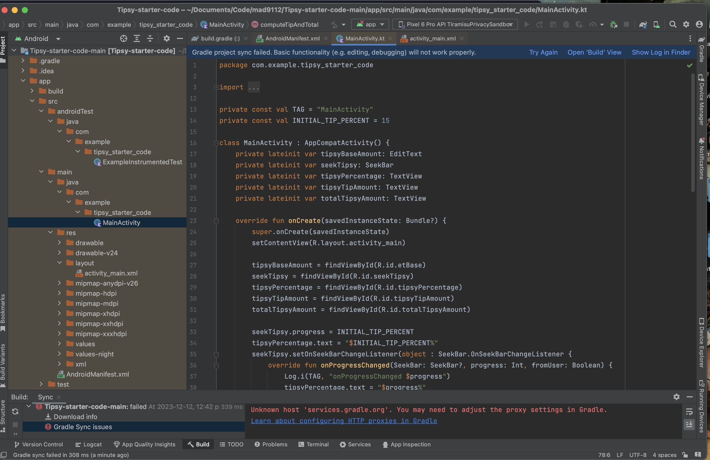
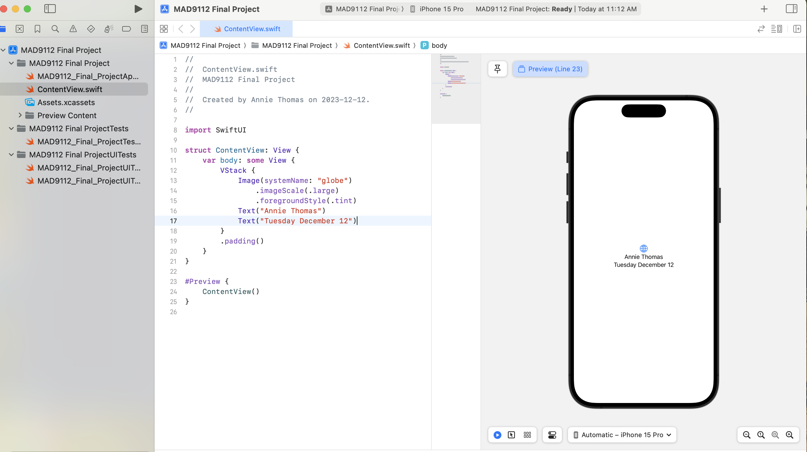
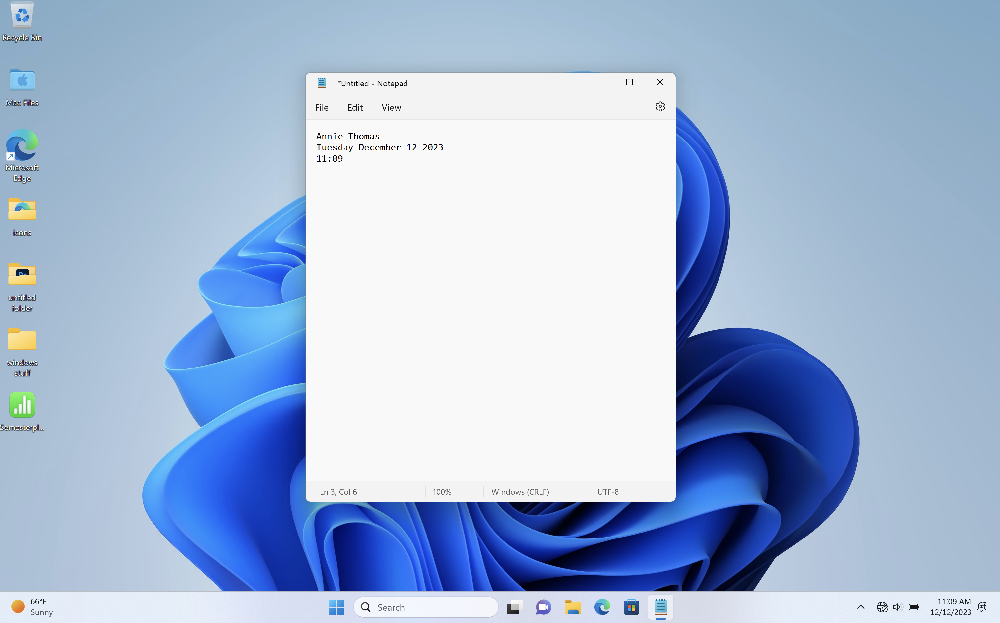

# Annie_Thomas_FinalProject

## Step 1:

``` 
function getDaysUntilChristmas (today) {
  let options = {day: 'numeric'};
  let xmas = new Date('2023-12-26');

  let todaysDay = today.toLocaleDateString('en-US', options);
  let xmasDay = xmas.toLocaleDateString('en-US', options);

  let daysTillXmas = xmasDay - todaysDay;

  
  console.log(daysTillXmas);

}
getDaysUntilChristmas(new Date());
```

## Step 2-4:








